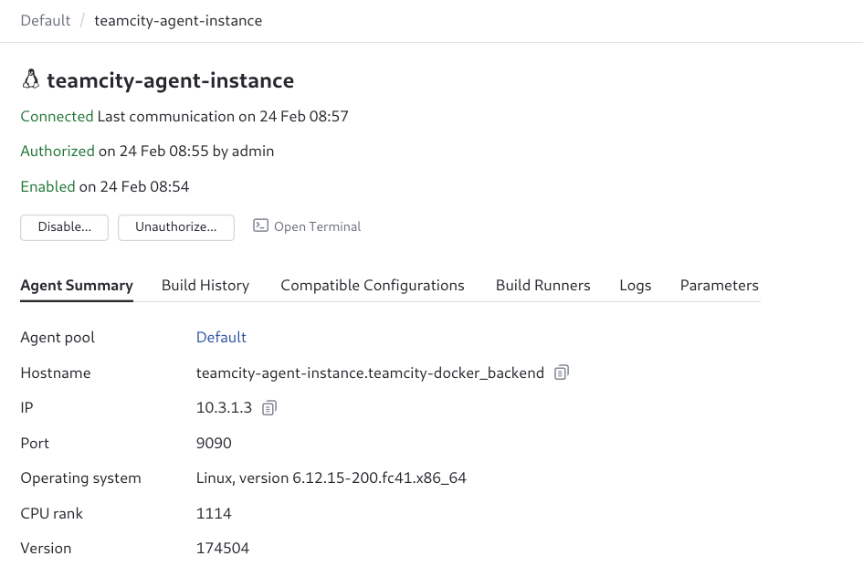
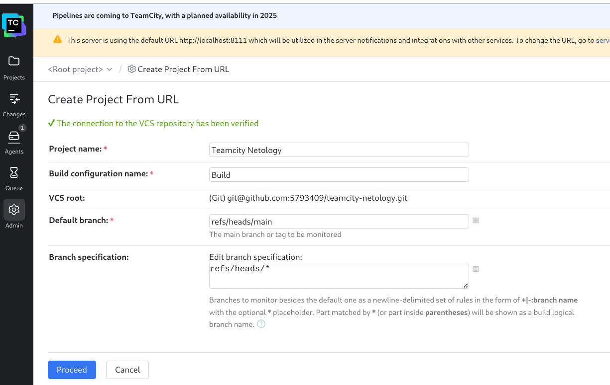
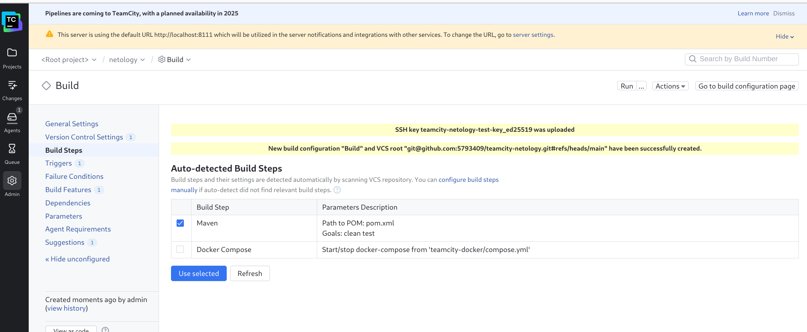
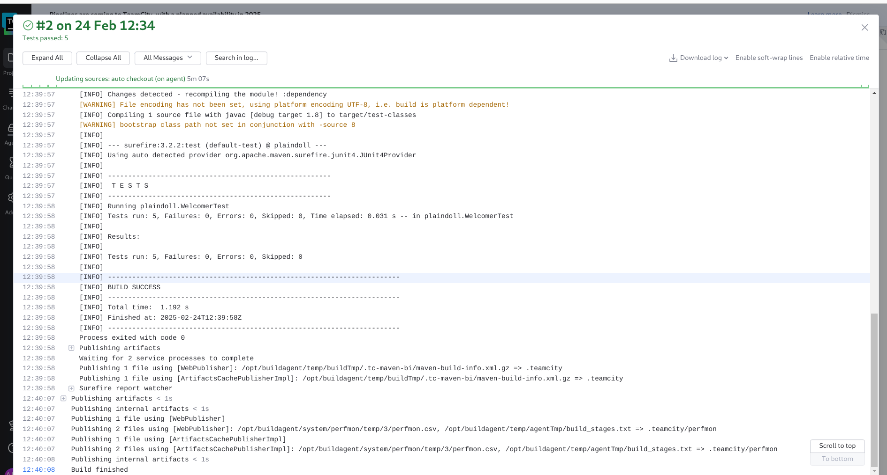
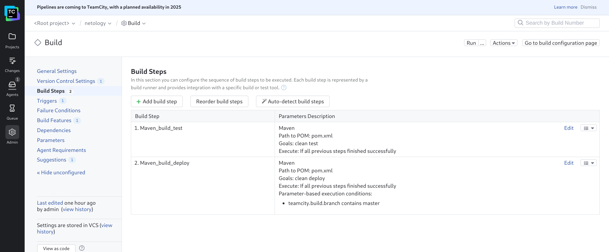
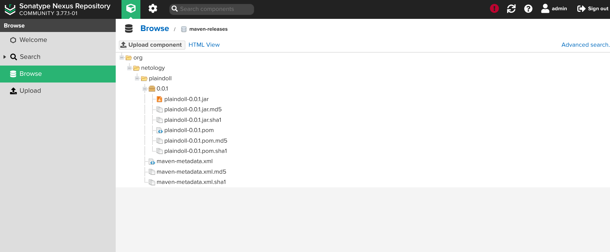
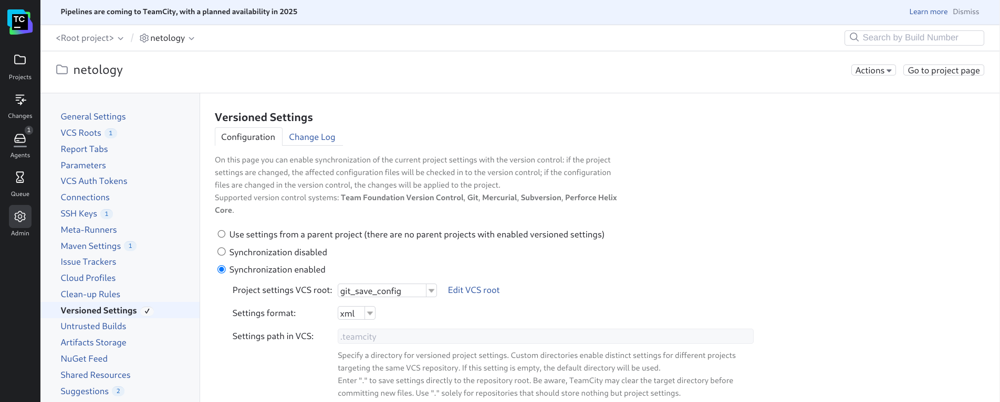
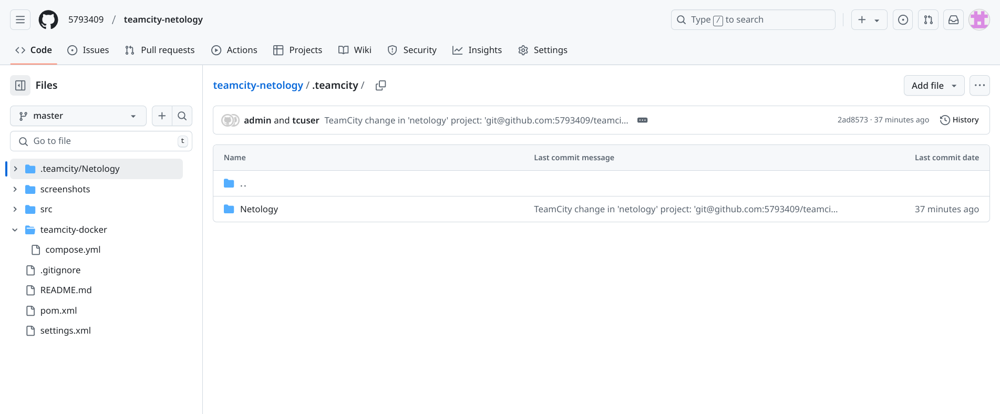
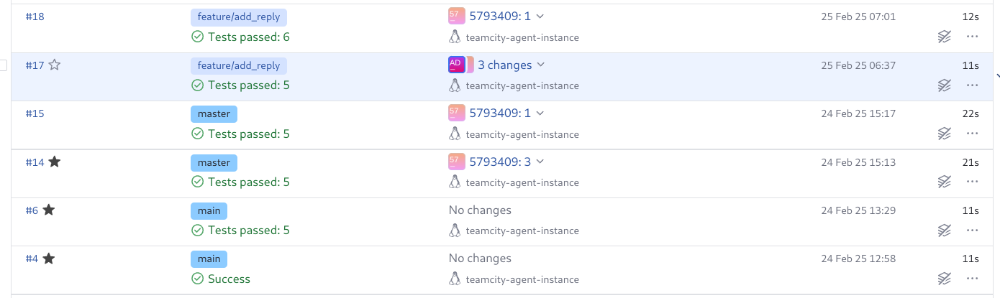

# Домашнее задание к занятию 11 «Teamcity»

## Подготовка к выполнению

Сервер Teamcity, агент и nexus запущены в докере.

[Docker compose file](https://github.com/5793409/teamcity-netology/blob/master/teamcity-docker/compose.yml)

## Выполнение

1. Подключаем и авторизуем агент
  

2. Создаем проект с привязкой на github
   

3. Проходим автодетект конфигурации
   

4. Проходим первую сборку, в первой интерации  будет только тестирование, поскольку репозиторий для артефактов еще не подключен.
    

5. меняем  условия сборки: если сборка по ветке master, то должен происходит mvn clean deploy, иначе mvn clean test, разница - в подключенном settings.xml для выгрузки артефакта в nexus
   

6. Если было обновление в ветке мастер и пройдены тесты, происходит выгрузка артефакта в nexus. .jar в артефактах сборки
 

7. Настраиваем выгрузку конфигурацию проекта TeamCity в github и выгружаем
     

   конфигурация выгружена в github
    

8. Создал новую ветку  feature/add_reply , добавил новый метод для класса Welcomer, дополнил тест.
   
Результат - счетчик тестов увеличен, поскольку ветка не мастер, артекфакты не выгружались.
    

---

### Решение задания
